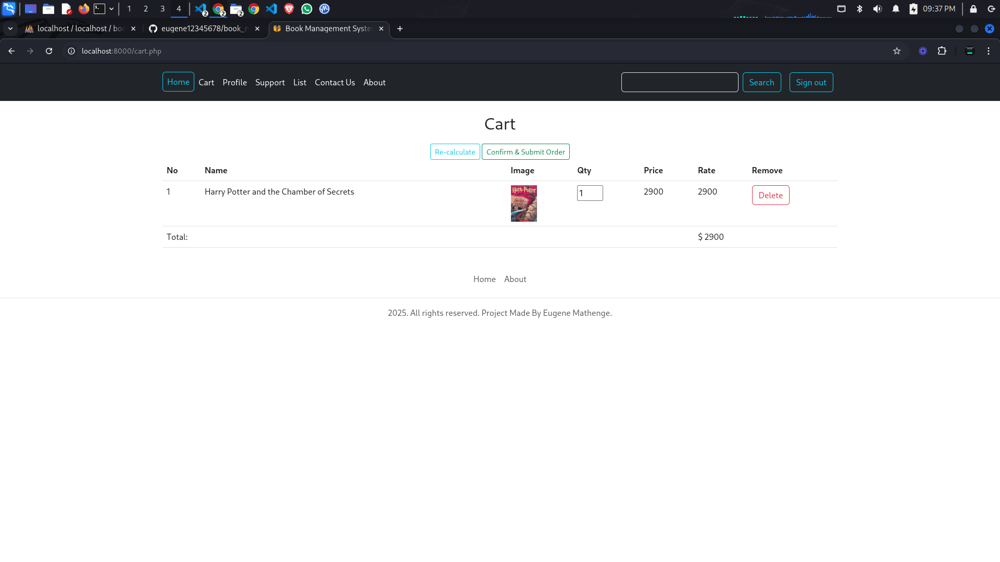

# Book Management System

## Overview

The **Book Management System** is a comprehensive solution designed to manage the operations of a bookstore, including user registration, login, book inventory management, shopping cart functionality, and order processing. This system provides a seamless experience for managing books, users, and orders while maintaining a secure and efficient backend.

### Features:
- **User Authentication:** Users can sign up, log in, and manage their profiles.
- **Book Inventory Management:** Add, update, and delete books in the system.
- **Shopping Cart:** Users can add books to their cart and proceed to checkout.
- **Order Management:** Track and process user orders efficiently.
- **Admin Panel:** Admins can manage users, books, and view reports.

## Technologies Used
- **Frontend:**
  - HTML5, CSS3, Bootstrap (for responsive design)
  - JavaScript (for interactive features)
- **Backend:**
  - PHP (for server-side logic)
  - MySQL (for database management)
- **Others:**
  - Session management for user login/logout
  - Password hashing for secure login
  - Seamless checkout experience with PayPal
  - Secure and encrypted payment gateway
  - Real-time order confirmation
  - 💳 Make Payment via PayPal (on going)


## Installation

Follow the steps below to set up the **Book Management System** locally:

### Prerequisites:
- PHP >= 7.4
- MySQL (or MariaDB) database server
- A local server environment such as **XAMPP** or **MAMP**

### Steps:

1. **Clone the repository:**
   ```bash
   git clone https://github.com/eugene12345678/book_management_system
   cd book-management-system
   ```

2. **Set up the database:**

   - Create a new database (e.g., `bookdatabase`) in your MySQL server.

   - Import the database structure (tables and initial data) by running the provided bookdatabase.sql file. You can find it in the `/book_management_system` directory of this project.

   Example of importing the SQL file:

   ```sql
   SOURCE /path/to/bookdatabase.sql;
   ```
3. **Configure the database connection:**

   - Open `includes/connection.php` and update the database credentials as per your local setup.

   ```php
   $host = 'localhost';
   $username = 'root';  // Your MySQL username
   $password = '';      // Your MySQL password
   $dbname = 'bookdatabase'; // The name of the database
   ```
4. **Start your local server:**

   - Start Apache and MySQL via XAMPP or MAMP, or use the built-in PHP server:

   ```bash
    php -S localhost:8000
   ```

   - Alternatively, you can run Apache and MySQL locally using ``systemctl`` on Linux:

   ```bash
   sudo systemctl start apache2
   sudo systemctl start mysql
   ```
   - Once Apache and MySQL are running, visit ``http://localhost:8000`` in your browser to access the application.


   **Explanation:**
   - The additional `systemctl` commands will allow users to start Apache and MySQL services on Linux-based systems (e.g., Ubuntu, Kali linux).


## Usage

Once the application is running, you can use the following features:

1. **Login/Register:**
   - Create a new account or log in to your existing account.
   - Admin users can log in using the following credentials:
     - **Admin Login (username: admin, password: admin)**
     - **Root Admin Login (username: root, password: root)**

2. **Browse Books:**
   - View available books, sorted by categories.
   - Each book displays its title, description, price, and availability.

3. **Add to Cart:**
   - Users can add books to their cart and proceed to checkout.

4. **Order and Checkout:**
   - After adding items to the cart, users can place an order and complete the checkout process.

5. **Admin Panel:**
   - Admins can manage users and books. They can add new books, delete existing ones, and manage customer orders.

## Screenshots
1. **Login Page**
   

2. **Book List**
   

3. **Admin Dashboard**
   

4. **Add Book**
   

5. **Cart**
   

6. **Order**
   

7. **Hash Password**
   

6. **Support**
   

## Contributing

We welcome contributions to this project! If you find a bug, have an idea for a feature, or would like to help improve the documentation, please follow these steps:

1. **Fork the repository**.
2. **Create a new branch**:
   ```bash
   git checkout -b feature-branch
   ```
3. **Make changes and commmit**
   ```bash
   git commit -m 'Add new feature'
   ```
4. **Push to your fork**
   ```bash
   git push origin feature-branch
   ```
5. **Open a pull request**

## Lincense
This project is licensed under the MIT License - see the LICENSE file for details.

## Contact
If you have any questions, feel free to reach out to the project maintainer:

- **Email:** eugenemathenge4@gmail.com

- **GitHub:** eugene12345678